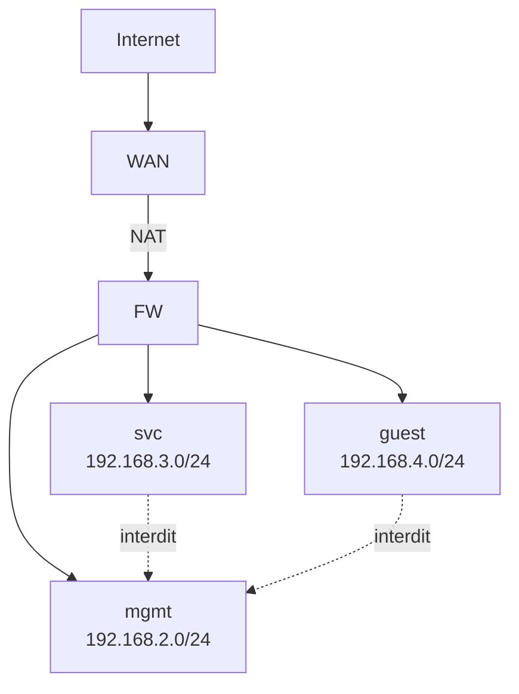
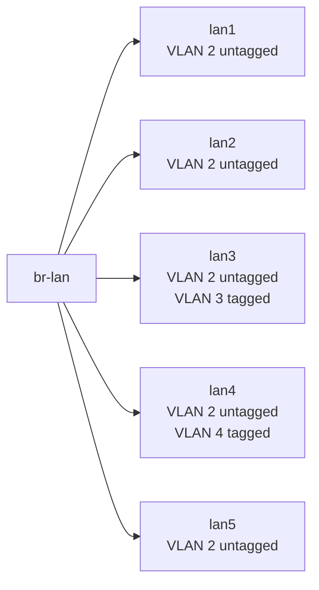
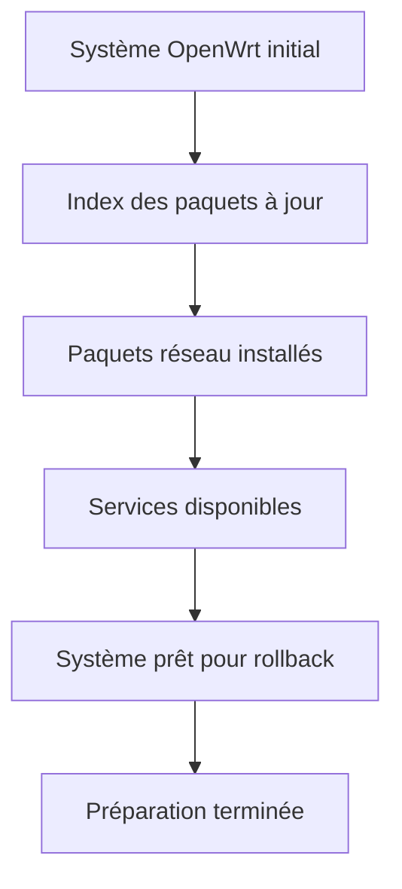
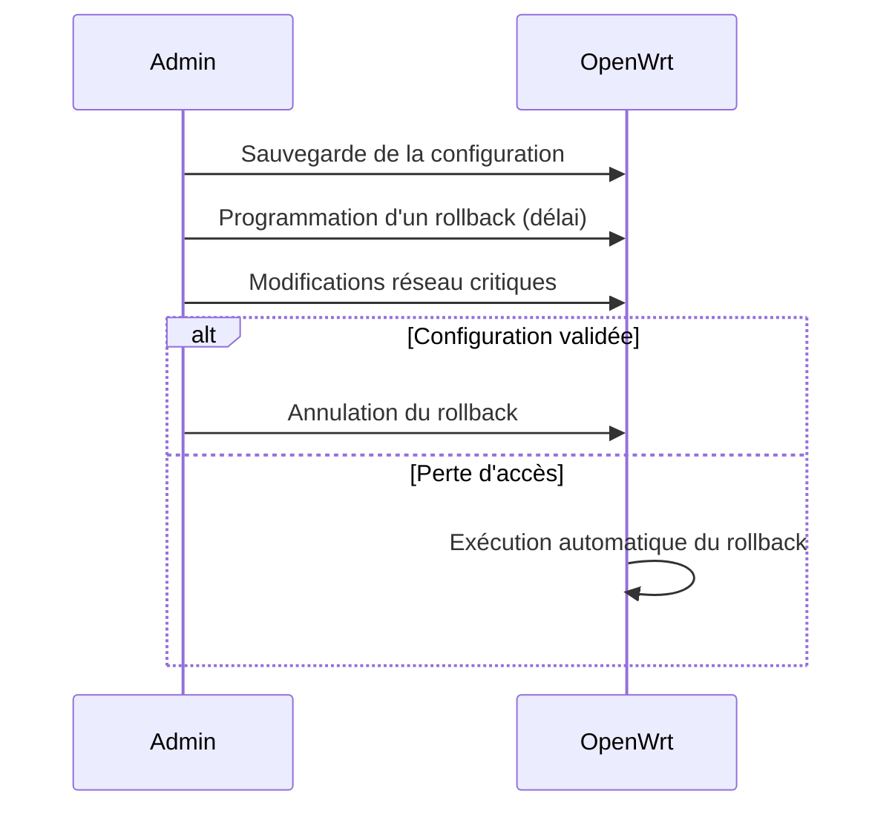
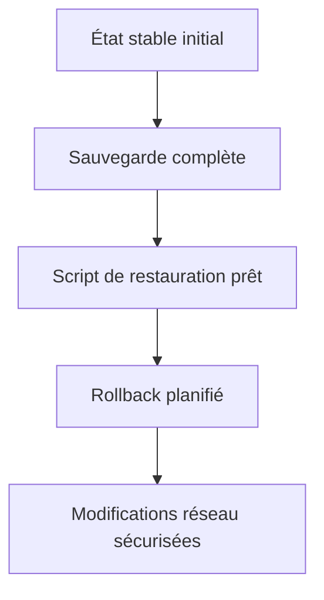

# Préambule

Cette documentation décrit une procédure d’installation et de configuration **manuelle** d’un système OpenWrt en s’appuyant principalement sur l’interface web LuCI. Elle vise à produire une configuration cohérente, segmentée et sécurisée, adaptée à un usage de type réseau domestique avancé ou petit laboratoire, avec séparation stricte des flux, services contrôlés et administration limitée à un périmètre dédié.

L’ensemble est présenté de manière progressive, chaque partie reposant sur les précédentes. La configuration finale repose sur des principes réseau classiques (segmentation VLAN, zones firewall, services explicites) afin de garantir lisibilité, maintenabilité et prévisibilité du comportement du routeur.

---

## Objectifs généraux de l’installation

L’installation aboutit à un routeur jouant le rôle de point central du réseau, assurant simultanément :

* la segmentation du réseau local en plusieurs domaines logiques indépendants,
* la fourniture des services essentiels (adressage IP, résolution DNS),
* le filtrage strict des flux inter-réseaux et vers Internet,
* l’exposition contrôlée de certains services via un tunnel VPN,
* la sécurisation de l’administration du routeur.

La philosophie générale consiste à **réduire la surface d’exposition**, à **éviter les comportements implicites**, et à **forcer toute communication à être explicitement autorisée**.

---

## Vue d’ensemble de l’architecture réseau

### Segmentation logique (niveau IP / firewall)

Trois réseaux locaux distincts sont définis, chacun associé à un rôle clair :

* **mgmt** : réseau d’administration, seul réseau autorisé à accéder au routeur pour la gestion.
* **svc** : réseau de services internes (serveurs, applications, conteneurs).
* **guest** : réseau destiné aux équipements non fiables ou invités.

Tous les réseaux disposent d’un accès sortant vers Internet, mais les communications latérales sont strictement contrôlées.

Dans ce modèle :

* le routeur est accessible uniquement depuis le réseau **mgmt**,
* les réseaux **svc** et **guest** ne peuvent contacter le routeur que pour des services strictement nécessaires (DHCP, DNS),
* aucun accès entrant depuis Internet n’est exposé directement.

---

## Organisation de niveau 2 : bridge et VLANs

L’architecture repose sur un **bridge LAN unique** (`br-lan`) utilisant le modèle DSA, sur lequel est activé le filtrage VLAN. Les ports Ethernet physiques sont agrégés dans ce bridge, puis segmentés logiquement via des VLANs.

Les VLANs utilisés sont :

* VLAN 2 → mgmt
* VLAN 3 → svc
* VLAN 4 → guest

Certains ports sont configurés comme ports d’accès simples (non tagués), tandis que d’autres acceptent à la fois un VLAN non tagué et un VLAN tagué, permettant un usage de type trunk léger.

Cette organisation garantit l’existence permanente de ports “stables” appartenant au réseau mgmt, indépendamment des VLANs transportés ailleurs.

---

## Plan d’adressage et conventions retenues

Afin d’assurer une lecture immédiate de la configuration, des conventions strictes sont appliquées :

* chaque VLAN est associé à un sous-réseau IPv4 dédié,
* l’adresse du routeur est toujours la première adresse du sous-réseau,
* le nom de l’interface OpenWrt correspond directement à l’identifiant VLAN.

Correspondance retenue :

| VLAN | Nom logique | Interface | Adresse du routeur |
| ---: | ----------- | --------- | ------------------ |
|    2 | mgmt        | vlan2     | 192.168.2.1/24     |
|    3 | svc         | vlan3     | 192.168.3.1/24     |
|    4 | guest       | vlan4     | 192.168.4.1/24     |

Le WAN repose sur une interface physique dédiée, configurée en adressage dynamique (DHCP).

---

## Sécurité opérationnelle et prévention des pertes d’accès

La modification de la topologie réseau (bridge, VLANs, interfaces IP) comporte intrinsèquement un risque de perte d’accès à l’interface d’administration. Cette documentation adopte donc une approche prudente et structurée.

Les principes retenus sont les suivants :

* les modifications réseau sont réalisées depuis un port appartenant au VLAN mgmt non tagué,
* les ports servant à l’administration ne sont jamais convertis en trunk exclusif,
* la bascule d’adresse IP de gestion est anticipée et planifiée,
* un mécanisme de retour arrière est prévu avant toute modification critique.

Le changement d’adresse de gestion (par exemple d’un réseau par défaut vers `192.168.2.1`) est considéré comme une étape normale du processus et non comme un incident.

---

## Philosophie de configuration des services

Les services du routeur ne sont jamais considérés comme globaux par défaut. Chaque service est explicitement :

* lié à une interface ou à une zone,
* autorisé ou refusé par le firewall,
* activé uniquement s’il est nécessaire.

Cette approche s’applique notamment à :

* la distribution DHCP,
* la résolution DNS,
* l’administration web (LuCI),
* l’accès SSH,
* les tunnels VPN.

---

## Méthodologie de la documentation

La suite de cette documentation est organisée par grands domaines fonctionnels, dans un ordre logique :

1. préparation du système et des paquets,
2. mise en place d’un mécanisme de retour arrière,
3. configuration du réseau (bridge, VLANs, interfaces),
4. configuration des services DHCP et DNS,
5. intégration d’AdGuard Home,
6. mise en place des tunnels WireGuard,
7. configuration détaillée du firewall,
8. sécurisation de l’accès administrateur,
9. finalisation et validation.

Chaque section décrit l’état attendu, le chemin exact dans l’interface LuCI, et les points de contrôle permettant de vérifier que la configuration est correcte avant de poursuivre.

## 1. Préparation du système

Cette section établit une base logicielle stable avant toute modification réseau. L’objectif est de s’assurer que le système OpenWrt dispose de tous les composants nécessaires, que les services requis existent et sont opérationnels, et que l’environnement est prêt à accueillir des changements structurants sans comportement imprévisible.

Aucune modification de topologie réseau n’est effectuée à ce stade. L’adresse de gestion actuelle reste valide et l’accès à l’interface LuCI doit être maintenu en permanence.

---

### 1.1 Mise à jour de l’index des paquets

La première étape consiste à synchroniser l’index des paquets afin de garantir l’installation des versions les plus récentes disponibles pour la distribution OpenWrt utilisée.

Dans LuCI, cette opération s’effectue depuis le menu **System → Software**. Une fois la page chargée, la mise à jour de la liste des paquets doit être déclenchée et menée à son terme sans erreur. Cette action n’installe encore rien, mais prépare le gestionnaire de paquets à résoudre correctement les dépendances.

Un système dont l’index n’est pas à jour peut aboutir à des installations incomplètes ou incohérentes, notamment pour des composants sensibles comme le firewall ou le support VLAN.

---

### 1.2 Paquets indispensables au fonctionnement réseau

Le cœur de la configuration repose sur quelques composants fondamentaux. Ils doivent être présents avant toute autre action, car l’ensemble de la suite s’appuie dessus.

Le routeur doit disposer :

* d’un moteur de firewall moderne compatible avec la gestion par zones,
* du support VLAN au niveau du noyau,
* d’un serveur DHCP/DNS local,
* d’un ensemble de certificats racine permettant des connexions sécurisées sortantes.

Dans l’interface LuCI, toujours via **System → Software**, l’installation ou la mise à jour de ces paquets est réalisée. Une fois installés, ils doivent apparaître comme présents et non “hold” ou “broken”.

À l’issue de cette étape, le système est capable de :

* filtrer les flux réseau,
* manipuler des interfaces VLAN,
* fournir un service DHCP/DNS fonctionnel.

Aucune configuration fine n’est encore appliquée, mais les briques sont en place.

---

### 1.3 Services complémentaires optionnels

Certaines fonctionnalités de l’architecture cible reposent sur des services supplémentaires. Ils ne sont pas strictement nécessaires pour le fonctionnement basique du routeur, mais sont requis pour la suite de la documentation.

Le premier concerne la capacité à planifier une action différée. Un service de planification simple permet de déclencher une restauration automatique en cas de problème lors d’une reconfiguration réseau. Ce service doit être installé et activé à ce stade afin d’être disponible avant toute opération risquée.

Le second concerne les fonctionnalités avancées de filtrage DNS. Un service dédié sera utilisé ultérieurement pour intercepter et traiter les requêtes DNS des clients du réseau local.

Enfin, la prise en charge des tunnels VPN repose sur des modules noyau et des outils utilisateurs spécifiques. Leur présence est vérifiée dès maintenant afin d’éviter toute ambiguïté plus tard lors de la création des interfaces VPN.

À l’issue de cette phase, la liste des services visibles dans **System → Startup** doit inclure, sans nécessairement être tous actifs :

* le service réseau,
* le firewall,
* le serveur DHCP/DNS,
* le service de planification,
* le service DNS filtrant,
* le service VPN.

---

### 1.4 Vérification de l’état des services

Une fois les paquets installés, l’état réel du système doit être observé. Cette vérification permet de détecter immédiatement une incohérence avant d’introduire de la complexité.

Dans **System → Startup**, chaque service essentiel doit apparaître sans erreur. Les services critiques (réseau, firewall, DHCP/DNS) doivent être actifs. Les services optionnels peuvent être actifs ou simplement activables, selon les besoins ultérieurs.

Cette étape ne vise pas à configurer, mais à confirmer que le socle logiciel est sain.

---

### 1.5 Positionnement avant les modifications réseau

À ce stade, le système est encore dans son état réseau initial. C’est volontaire. Avant d’aller plus loin, il est important de figer mentalement la situation actuelle :

* une seule interface LAN fonctionnelle,
* une seule adresse IP de gestion,
* une connectivité stable à LuCI.

La suite de la documentation va progressivement transformer cette configuration simple en une topologie segmentée. Cette transformation est irréversible sans action volontaire. C’est pour cette raison que la prochaine section est consacrée exclusivement à la **mise en place d’un mécanisme de retour arrière**.

Ce mécanisme agit comme une ceinture de sécurité : il ne modifie pas le comportement nominal du routeur, mais garantit qu’une erreur de configuration ne conduit pas à une perte d’accès définitive.

---

### Vue synthétique de la préparation

Cette séquence clôt la phase de préparation. Le système est désormais prêt à être modifié de manière structurée et sécurisée.

## 2. Mise en place d’un mécanisme de retour arrière

Cette section décrit la mise en place d’un mécanisme de sécurité destiné à restaurer automatiquement un état fonctionnel du routeur en cas de perte d’accès après une modification critique, en particulier lors de la reconfiguration du réseau.
Ce mécanisme n’intervient pas dans le fonctionnement normal du système ; il agit uniquement comme une assurance temporaire, activée avant des changements à fort impact et désactivée une fois la configuration validée.

L’objectif est d’éliminer le risque de blocage définitif nécessitant une intervention physique (reset matériel ou accès console).

---

### 2.1 Principe général du retour arrière

Le mécanisme repose sur trois éléments simples :

* une **sauvegarde complète de l’état de configuration** du routeur,
* un **script de restauration** capable de remettre cet état en place,
* une **exécution différée automatique** de ce script après un délai donné.

Le fonctionnement est volontairement pessimiste : tant que la restauration n’est pas explicitement annulée, elle est considérée comme nécessaire. Si l’administration reste accessible et que la configuration est validée, l’exécution différée est annulée manuellement.

Ce principe est illustré ci-dessous :

---

### 2.2 Portée de la sauvegarde

La sauvegarde couvre l’ensemble des éléments nécessaires à un retour fonctionnel immédiat :

* les fichiers de configuration réseau,
* les règles de firewall,
* la configuration DHCP/DNS,
* les paramètres Wi-Fi,
* la configuration des services d’administration.

Plutôt que de s’appuyer sur un unique fichier d’archive opaque, la sauvegarde est réalisée sous forme de fichiers lisibles, permettant une inspection ou une restauration partielle si nécessaire. Une copie complète du répertoire `/etc/config` est également conservée afin de garantir la cohérence globale.

Cette approche permet un retour arrière fiable, même si plusieurs services sont modifiés simultanément.

---

### 2.3 Emplacement et isolation des sauvegardes

Les sauvegardes sont stockées dans un répertoire dédié, situé hors des chemins de configuration standards. Ce répertoire possède des permissions strictes afin d’éviter toute modification accidentelle.

Chaque sauvegarde est horodatée, ce qui permet :

* d’identifier clairement l’état restauré,
* de conserver un historique minimal,
* de référencer explicitement la dernière sauvegarde valide.

Un fichier de référence indique l’horodatage de la sauvegarde considérée comme “courante” pour le rollback automatique.

---

### 2.4 Script de restauration

Le script de restauration est un fichier exécutable simple, stocké localement sur le routeur. Il réalise les opérations suivantes :

* lecture de l’horodatage de la sauvegarde active,
* restauration complète du répertoire de configuration,
* redémarrage contrôlé des services critiques.

Le script est volontairement minimaliste. Il ne contient aucune logique conditionnelle complexe et n’effectue aucune validation sophistiquée. Son rôle est strictement de revenir à un état antérieur connu comme fonctionnel.

Cette simplicité réduit le risque d’échec au moment où le script est exécuté automatiquement, sans supervision.

---

### 2.5 Planification de l’exécution différée

L’exécution différée du rollback est planifiée avec un délai volontairement court. Ce délai doit être suffisant pour effectuer les modifications prévues et vérifier l’accès, mais suffisamment court pour éviter une indisponibilité prolongée en cas de problème.

Une fois planifiée, l’exécution est indépendante de toute session d’administration. Même en cas de coupure totale de l’accès réseau, le système exécutera automatiquement la restauration à l’expiration du délai.

Le mécanisme de planification est déclenché avant toute modification critique et doit être considéré comme obligatoire lors des étapes suivantes de la documentation.

---

### 2.6 Moment d’annulation du rollback

L’annulation du rollback n’est effectuée qu’une fois toutes les conditions suivantes réunies :

* l’accès réseau est restauré sur la nouvelle topologie,
* l’administration est accessible via le réseau mgmt,
* les services essentiels répondent correctement.

L’annulation marque la validation définitive de la configuration. Tant que cette action n’a pas été réalisée, le système reste dans un état “provisoire”.

---

### 2.7 Positionnement dans la procédure globale

À l’issue de cette section, le système dispose :

* d’un état de référence sauvegardé,
* d’un mécanisme de restauration automatique prêt à être déclenché,
* d’un filet de sécurité actif pour les modifications réseau à venir.

Aucune modification fonctionnelle n’a encore été apportée au réseau. Le système est simplement préparé à encaisser une reconfiguration profonde sans risque de perte définitive d’accès.

---

### Section suivante

La section suivante traite de la **configuration du réseau local**, incluant la création du bridge, l’activation du filtrage VLAN et la définition des interfaces IP correspondant aux différents segments logiques.
